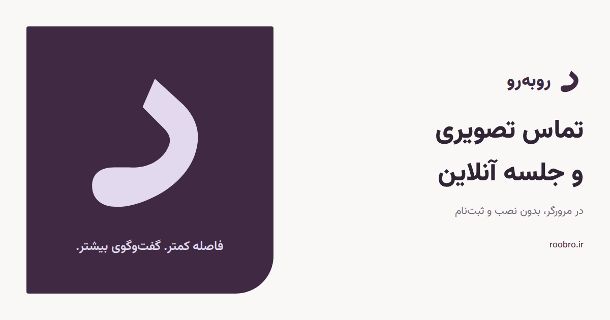

# رو به رو

<p align="center">
  <picture>
    <source media="(prefers-color-scheme: dark)" srcset="frontend/public/logo-light.svg" />
    
  </picture>
</p>

<p align="center">
  A Persian video-meeting experience designed for natural, focused conversations.
</p>

<p align="center">
  <a href="https://roobro.ir">Website</a> ·
  <a href="#local-development">Local development</a> ·
  <a href="#docker-server-deployment">Deploy</a> ·
  <a href="#api">API</a> ·
  <a href="docs/deployment.md">Deployment guide</a>
</p>



## About

رو به رو makes it simple to create and join browser-based video meetings with a human-friendly share code. The interface is Persian and RTL, and realtime credentials stay behind a Go API.

The app can also run in an interactive demo mode, so the full meeting flow remains explorable when the API or LiveKit is not configured.

## Features

- Create meetings and invite people with a short share code or link
- Preview your camera and choose microphone/camera state before joining
- Join realtime rooms powered by LiveKit
- Use a Persian RTL interface powered by i18next
- Use in-room video, audio, screen sharing, chat, participant details, and host actions
- Inspect your connection quality, ping, jitter, packet loss, media rates, and per-stream diagnostics from the connection badge or mobile menu
- Keep LiveKit token generation and host authorization on the server
- Explore the product without infrastructure through the built-in demo fallback
- Use a responsive interface designed for desktop and mobile

## Watch and listen together

Open the music button in the room controls (or the mobile More menu). Each
participant selects or drops their own copy of the same audio/video file. One
person starts the shared session, then each person clicks Join playback. Play,
pause, seek, and ending the session apply to the group; volume stays local.
Closing the panel keeps playback running.

Use the expand button above the video (or double-click the video) to fill the
meeting area without restarting playback. Escape or the restore button returns
it to the sidebar. The participant list shows who has not picked a file, is
checking a file, has a matching or different copy, or has explicitly joined and
is ready. Buffering, blocked audio, and stale status updates are shown separately.
The ready count helps the group decide when to press Play; it does not start or
block playback automatically. Readiness is specific to each shared session.

The file is never uploaded or transferred. Only its name, size, duration, a
sampled fingerprint, playback state, and participant readiness travel over LiveKit data packets. The
fingerprint checks small portions at the start, middle, and end, so it catches
common mismatches without reading a whole film into memory; it is not a full-file
integrity check. Files must be playable by each participant's browser. Shared
URLs and streaming a single participant's file are not part of this version.

The earliest connected participant coordinates controls, using LiveKit join
times and identity as a tie-breaker. Clients estimate clock offsets, correct
drift, and request snapshots every two seconds, including after reconnecting.
Losing the coordinator pauses the timeline until someone resumes. A stalled
participant catches up when ready rather than pausing the group. Sessions last
only for the room's connected browsers; demo mode provides local playback only.

## Tech stack

| Layer | Technology |
| --- | --- |
| Web app | React 19, TanStack Router, Vite, TypeScript |
| Styling | Tailwind CSS 4, custom responsive CSS |
| Localization | i18next, react-i18next |
| Realtime media | LiveKit |
| API | Go, Gin |
| Development | Bun, Docker Compose, Make |

## How it works

The frontend image uses Caddy to serve the Vite-built React application and
forward `/api/*` and `/health` to the Go API through one HTTP port. Deployers
provide their own public reverse proxy, domains, and HTTPS configuration. The API
creates meetings, authorizes hosts, and signs LiveKit access tokens; browsers then connect directly to LiveKit for signaling and media.
LiveKit sends signed room-lifecycle webhooks back to the API.

## Local development

### Prerequisites

- [Bun](https://bun.sh/)
- [Go](https://go.dev/) 1.27 or later
- [Docker](https://www.docker.com/) with Docker Compose

Install the application dependencies:

```bash
git clone https://github.com/4H1R/roobro.git
cd roobro
make install
```

Start the Go API and local LiveKit server:

```bash
make up
```

In a second terminal, start the frontend:

```bash
make frontend
```

Open [http://localhost:3000](http://localhost:3000). Vite proxies `/api` to the Go API on port `8080` and `/rtc` to LiveKit on port `7880`.

## Configuration

Development defaults are built into `docker-compose.yml`. Copy `.env.example`
to `.env` only when overriding local settings:

```bash
cp .env.example .env
```

Production uses `.env.prod`. The server installer generates it automatically;
manual deployments start from `.env.prod.example` and are documented in the
[deployment guide](docs/deployment.md).

| Variable | Purpose | Development default |
| --- | --- | --- |
| `APP_ENV` | Application environment | `development` |
| `PORT` | API listen port | `8080` |
| `FRONTEND_URL` | Allowed frontend origin | `http://localhost:3000` |
| `LIVEKIT_HOST` | Private LiveKit API URL | `http://localhost:7880` |
| `LIVEKIT_PUBLIC_URL` | Browser-reachable LiveKit WebSocket URL | `ws://localhost:7880` |
| `LIVEKIT_API_KEY` | LiveKit API key | `devkey` in Compose |
| `LIVEKIT_API_SECRET` | LiveKit API secret | `devsecret` in Compose |

Use a public `wss://` URL for `LIVEKIT_PUBLIC_URL` in production.
The development and production Compose stacks automatically configure the
self-hosted LiveKit webhook. When using LiveKit Cloud, configure a signed webhook
to `https://<your-api-host>/api/v1/livekit/webhook`. The webhook keeps meeting
status in sync when an empty LiveKit room closes after five minutes.

## API

The API is served under `/api/v1`:

| Method | Endpoint | Description |
| --- | --- | --- |
| `POST` | `/api/v1/meetings` | Create a meeting |
| `GET` | `/api/v1/meetings/:code` | Get meeting details |
| `POST` | `/api/v1/meetings/:code/join` | Join and receive a LiveKit token |
| `POST` | `/api/v1/meetings/:code/end` | End a meeting as its host |
| `POST` | `/api/v1/livekit/webhook` | Receive signed LiveKit room lifecycle events |

A health check is available at `GET /health`.

Meeting responses include backend-maintained `analytics` counters for participant joins,
unique/current/peak participants, camera, screen-share and microphone activations, and
participant removals and bans. These counters contain no per-event timestamps or history.

## Common development commands

```bash
make test        # backend tests, frontend type-check, and frontend tests
make front-build # production frontend build
make logs        # follow all container logs
make ps          # inspect container status
make restart     # restart the stack
make down        # stop the stack
```

## Docker server deployment

On a publicly reachable Linux AMD64 or ARM64 server with Docker Compose v2, this
one-liner downloads the deployment files, generates credentials, and starts the
frontend, API, and LiveKit containers. The frontend provides one HTTP entry
point for the web app and API; you control the public reverse proxy and HTTPS.

This first stage is an HTTP smoke deployment. The containers will be ready, but
remote camera and microphone access requires the DNS/TLS step in the deployment
guide.

```bash
curl -fsSL https://raw.githubusercontent.com/4H1R/roobro/main/deploy/install.sh | sudo sh
```

It installs under `/opt/roobro` and writes the generated settings to
`/opt/roobro/.env.prod`. See the complete [deployment and environment
guide](docs/deployment.md) for firewall ports, updates, rollbacks, every
environment variable, and the optional domain/TLS step. Browsers require HTTPS
to grant camera and microphone access; the IP-based HTTP deployment is intended
to prepare and smoke-test the stack before DNS and TLS are attached.

## Repository layout

| Path | Purpose |
| --- | --- |
| `cmd/api/` | Go API entry point |
| `internal/` | Meeting domain, service, HTTP, and LiveKit integration |
| `frontend/` | React/Vite application and frontend tests |
| `deploy/` | Installer and Caddy configurations |
| `docs/` | Operations and deployment documentation |

## Current limitation

The backend stores meeting metadata in memory. Restarting the API clears active
meeting metadata, and multiple API replicas do not share state yet. The repository
interface is ready for a persistent implementation without changing handlers or
the meeting service.

## Resource and retention limits

The single API process admits at most 100 stored meetings. Unused meeting links
expire after one hour; ended summaries expire after 15 minutes. Ending a meeting
immediately releases chat, sessions and detailed analytics. Active meetings stay
until the host ends them or LiveKit reports the room finished, and count against
the limit throughout. API-backed demo meetings, which have no LiveKit lifecycle
webhooks, expire after five minutes without chat/session activity.

Chat retains only the latest 200 messages, with monotonically increasing IDs.
The history switch exposes only that retained window; disabling history still
excludes messages sent before a participant joined. Each room admits 100 chat
sessions, which expire after 12 hours or five idle minutes. Signed participant
departure events retire matching old sessions using a public, non-secret session
correlation attribute. Missing or modified attributes fall back to idle expiry;
delayed events cannot revoke a newer join's token.
Rejoining the same participant identity
replaces its old chat token. Browser chat state is also limited to 200 messages.
Room joins and chat sends each allow 10 requests/second with a burst of 20.
Meeting creation allows one/second globally with a burst of 10. Capacity and
rate failures return HTTP 429; clients should retry later.

API bodies are limited to 64 KiB, or 1 MiB for signed LiveKit webhooks, before
decoding or authentication (including chunked requests). The API permits 64
requests in flight, 1,000 requests/second globally (burst 2,000), and 200/second
per TCP peer (burst 400). Per-peer creation allows one every five seconds with
a burst of 10. Peer-budget bookkeeping is capped at 2,048 entries and idle
entries expire after five minutes. Forwarding headers cannot change these peer
budgets: behind the frontend proxy all clients share its peer budget. A public
proxy can additionally impose per-client limits.

Analytics deduplication sets are capped at 1,024 entries each; when detail cannot
be retained, analytics responses set `truncated: true` and totals may be partial.
Ban sets accept at most 1,000 identities per meeting and reject further additions
explicitly without forgetting existing bans. Anonymous identifiers remain
client-supplied; banning an identity does not authenticate or permanently exclude
a person using a new identifier.

## Contributing

Issues and pull requests are welcome. Run `make test` and `make front-build`
before submitting a change.
